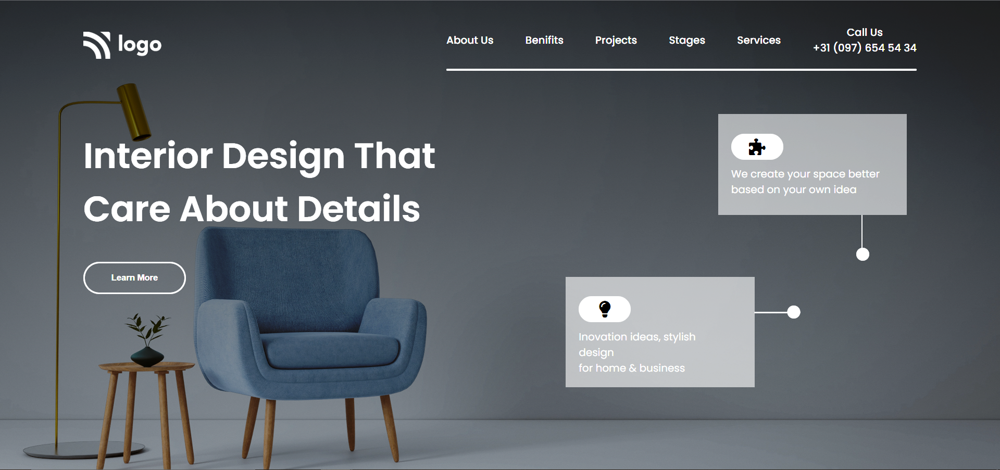

# HTML-CSS-PROJECT-10

In this project, we used CSS media queries and flexbox properties to create a responsive design that adapts to different screen sizes.

# Description

in this project, i have learn @media query to define different styles for different screen sizes. The @media query is a CSS rule that allows us to define styles for specific conditions, such as screen size or device type. 

As part of this project, I have learnt the flex property to create a flexible layout that adapts to different screen sizes. The flex property is a CSS property that allows us to define a flexible container that can grow or shrink to fit its content.

# Screenshot

